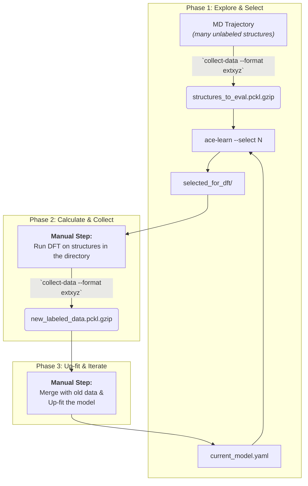
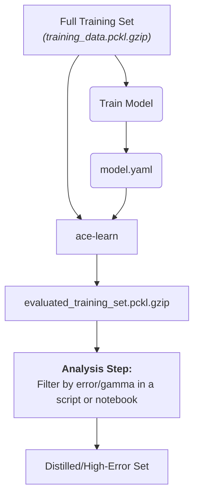

# MyACE Project Utilities

This project provides a set of standardized tools for collecting and processing data for training Atomic Cluster Expansion (ACE) potentials. It's designed to support a robust active learning and data analysis workflow.

## Core Tools

- **`collect-data`**: A general-purpose tool to parse data from various sources (VASP outputs, LAMMPS dumps, `extxyz` directories) and build a standardized `pandas.DataFrame`.
- **`ace-learn`**: A flexible tool to evaluate a set of structures against a trained ACE potential. It can be used to explore unknown structures or to analyze the performance on known training data.

---

## Workflows

This toolkit is designed to support two primary workflows common in potential development.

### Workflow A: Active Learning — Exploring Unknown Structures

**Goal:** To intelligently select the most valuable new structures for expensive DFT calculations from a large pool of unlabeled candidates (e.g., from an MD simulation).

**Conceptual Flow:**



**Step-by-Step Guide:**

1. **Prepare Exploration Set**: Use `collect-data` to parse a large number of unlabeled structures (e.g., from a LAMMPS dump or `.xyz` trajectory) into a standardized DataFrame.

   ```bash
   # Example for a LAMMPS dump file. Note the crucial use of --lammps-map.
   # This creates a DataFrame with 'name' and 'ase_atoms' columns.
   collect-data simulation.dump --format lammps-dump --lammps-map "1:Si,2:O" --output structures_to_eval.pckl.gzip
   ```

2. **Evaluate & Select**: Use `ace-learn` with your current potential to evaluate these structures and select the `N` most uncertain candidates.

   ```bash
   ace-learn current_potential.yaml structures_to_eval.pckl.gzip --asi current_potential.asi --select 20 --output-selection-dir selected_for_dft
   ```

   This creates a directory `selected_for_dft/` containing 20 `.xyz` files, ready for calculation.

3. **Perform DFT Calculations**: This is a manual step. Run high-accuracy DFT calculations on the structures inside the `selected_for_dft/` directory. It's recommended to save the results by overwriting the existing `.xyz` files, as `ase.io.write` will embed the new energy and forces.

4. **Collect New Labeled Data**: Use `collect-data` again, this time to parse the directory containing your newly finished DFT calculations.

   ```bash
   collect-data selected_for_dft/ --format extxyz --ref-energies ref.json --output new_labeled_data.pckl.gzip
   ```

5. **Up-fit and Iterate**: Merge `new_labeled_data.pckl.gzip` with your main training set and re-train (or up-fit) your potential to create the next-generation model. The cycle then repeats.


### Workflow B: Training Set Analysis — Refining Known Data

**Goal:** To analyze a model's performance on its own training set to identify high-error structures, or to distill a smaller, core set of "support" structures.

**Conceptual Flow:**



**Step-by-Step Guide:**

1. **Inputs**: You need your trained potential (`model.yaml`) and the complete, labeled DataFrame (`training_data.pckl.gzip`) that was used to train it.

2. **Perform Self-Evaluation**: Run `ace-learn` on the training set itself. Since the input DataFrame contains `energy` and `forces` columns, the output will automatically include error metrics.

   ```bash
   rye run ace-learn model.yaml training_data.pckl.gzip --asi model.asi --output-eval-df evaluated_training_set.pckl.gzip
   ```

3. **Analyze and Distill**: Load the resulting `evaluated_training_set.pckl.gzip` into a Python script or Jupyter Notebook. You can now easily sort and filter this DataFrame by `max_gamma`, `energy_error_per_atom`, or `forces_rmse` to:

   *   Pinpoint structures that the model struggles to describe.
   *   Select a subset of high-gamma structures that form the "core" of the training set.

---

## Programmatic API (Advanced Usage)

Beyond the command-line tools, `myace` exposes a high-level Python API for advanced, customized workflows in scripts or Jupyter notebooks.

### Core Functions

You can access the core logic of the command-line tools directly:

- **`myace.build_dataset(...)`**: The engine behind `collect-data`. Parses source files and builds a DataFrame.

  ```python
  import myace
  # Build a dataset from a VASP OUTCAR
  dft_results_df = myace.build_dataset(
      input_path='./OUTCAR',
      format='vasp',
      ref_energies={'Si': -4.5}
  )
  ```

- **`myace.evaluate_and_select(...)`**: The engine behind `ace-learn`. Evaluates a DataFrame and optionally selects candidates.

  ```python
  # Evaluate the dataset and select 20 candidates
  evaluated_df, selected_df = myace.evaluate_and_select(
      df=dft_results_df,
      potential_file='model.yaml',
      asi_file='model.asi',
      select_n=20
  )
  ```

### I/O Module: `myace.io`

For convenience, common I/O operations are bundled in the `myace.io` module.

- **`myace.io.read(path)`**: Reads a `.pckl.gzip` file into a DataFrame.
- **`myace.io.write(df, path)`**: Writes a DataFrame to a `.pckl.gzip` file.
- **`myace.io.export_to_extxyz(df, output_dir)`**: Exports each row of a DataFrame to a separate `.xyz` file in a directory.
- **`myace.io.export_to_vasp(df, output_dir)`**: Exports each row of a DataFrame to a separate VASP `POSCAR` file, named after the DataFrame index.
- **`myace.io.read_gosh_parquet(path)`**: Reads a `.parquet` file generated by [gosh-adaptor](https://github.com/gosh-rs/gosh-adaptor) and converts it into a `myace`-standard DataFrame. `gosh-adaptor` is a tool that collects calculation information (energy, forces, stress, etc.) from various simulation software outputs (like VASP OUTCARs, LAMMPS dumps, etc.) into a standardized Parquet format.

  **Example Workflow with `gosh-adaptor` and `myace`:**

  1.  First, use `gosh-adaptor` to process your raw simulation output. For instance, to parse a VASP OUTCAR:
      ```bash
      # On your command line (assuming gosh-adaptor is installed)
      gosh-adaptor vasp OUTCAR --output outcar_data.parquet
      ```
      This will create a `outcar_data.parquet` file.

  2.  Then, in your Python script, use `myace.io.read_gosh_parquet` to load this data, followed by `myace.data_processing.add_corrected_energies` to prepare it for `pacemaker`:
      ```python
      from myace import io
      from myace.data_processing import add_corrected_energies # Import the new function

      parquet_file_path = "outcar_data.parquet" # Path to the file generated by gosh-adaptor
      # Define your elemental reference energies (replace with actual values for your system)
      elemental_reference_energies = {
          "Si": -4.500, # Example for Silicon
          "O": -75.023  # Example for Oxygen
          # Add other elements present in your OUTCAR/parquet file
      }

      try:
          # Step 1: Load raw data using gosh-parquet reader
          raw_df = io.read_gosh_parquet(parquet_file_path)
          print(f"Successfully loaded {len(raw_df)} configurations from '{parquet_file_path}'.")

          # Step 2: Add corrected energies for pacemaker compatibility
          pacemaker_ready_df = add_corrected_energies(raw_df, elemental_reference_energies)
          
          if 'energy_corrected' in pacemaker_ready_df.columns:
              print("Successfully added 'energy_corrected' and 'energy_corrected_per_atom' columns.")
              
              # Now pacemaker_ready_df is ready for use. You can:
              # a) Save it in the myace standard .pckl.gzip format
              io.write(pacemaker_ready_df, "myace_from_gosh_pacemaker_ready.pckl.gzip")
              print(f"Pacemaker-ready data saved to 'myace_from_gosh_pacemaker_ready.pckl.gzip'.")
              print("\nPacemaker-ready DataFrame info:")
              pacemaker_ready_df.info(verbose=False)


              # b) Or use it directly with other myace API functions
              # (e.g., if you have a potential to evaluate against)
              #
              # from myace import evaluate_and_select
              # evaluated_df, _ = evaluate_and_select(
              #     df=pacemaker_ready_df, # Use the processed DataFrame
              #     potential_file='path/to/your/model.yaml',
              #     asi_file='path/to/your/model.asi' # Optional, for gamma values
              # )
              # print("\\nEvaluated DataFrame from gosh_parquet data:")
              # print(evaluated_df.head())
          else:
              print("Failed to add corrected energy columns. Please check logs and reference energies.")

      except FileNotFoundError:
          print(f"Error: Parquet file '{parquet_file_path}' not found. "
                "Please ensure gosh-adaptor ran successfully and the path is correct.")
      except Exception as e:
          print(f"An error occurred while processing '{parquet_file_path}': {e}")
      ```

### Example: A Custom Scripting Workflow

The API allows for flexible combination of these functions to create powerful custom workflows.

```python
import myace
from myace import io

# 1. Load a previously created dataset
structures_df = io.read('structures_to_eval.pckl.gzip')

# 2. Evaluate and select using the API
evaluated_df, selected_df = myace.evaluate_and_select(
    df=structures_df,
    potential_file='model.yaml',
    asi_file='model.asi',
    select_n=10,
    gamma_threshold=15.0 # Use a custom threshold
)

# 3. Perform custom filtering on the results
# Find candidates that are not only uncertain but also have a low ACE energy
custom_selection = selected_df[selected_df['ace_energy'] < -500]

# 4. Export the final, custom-filtered set for DFT calculations
print(f"Exporting {len(custom_selection)} custom-selected candidates...")
io.export_to_extxyz(custom_selection, 'custom_selection_for_dft/')
