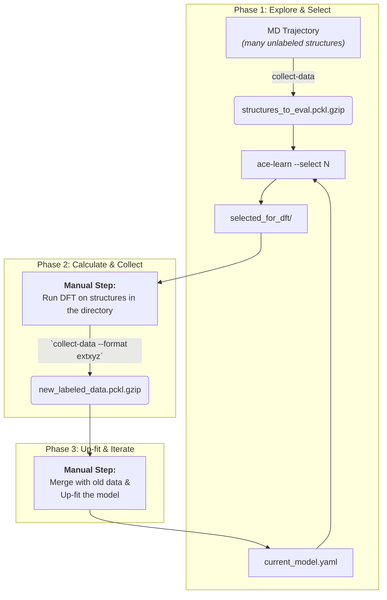
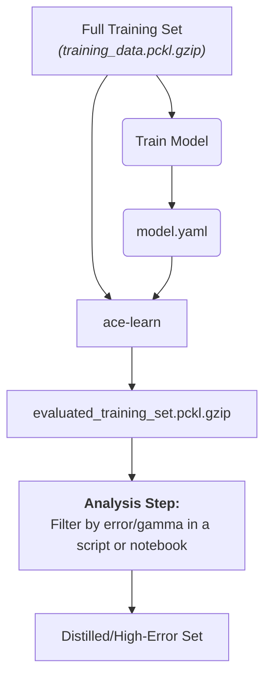

# MyACE Project Utilities

This project provides a set of standardized tools for collecting and processing data for training Atomic Cluster Expansion (ACE) potentials. It's designed to support a robust active learning and data analysis workflow.

## Core Tools

- **`collect-data`**: A general-purpose tool to parse data from various sources (VASP outputs, LAMMPS dumps, `extxyz` directories) and build a standardized `pandas.DataFrame`.
- **`ace-learn`**: A flexible tool to evaluate a set of structures against a trained ACE potential. It can be used to explore unknown structures or to analyze the performance on known training data.

---

## Workflows

This toolkit is designed to support two primary workflows common in potential development.

### Workflow A: Active Learning — Exploring Unknown Structures

**Goal:** To intelligently select the most valuable new structures for expensive DFT calculations from a large pool of unlabeled candidates (e.g., from an MD simulation).

**Conceptual Flow:**



**Step-by-Step Guide:**

1. **Prepare Exploration Set**: Use `collect-data` to parse a large number of unlabeled structures (e.g., from a LAMMPS dump or `.xyz` trajectory) into a standardized DataFrame.

   ```bash
   # Example for a LAMMPS dump file. Note the crucial use of --lammps-map.
   # This creates a DataFrame with 'name' and 'ase_atoms' columns.
   collect-data simulation.dump --format lammps-dump --lammps-map "1:Si,2:O" --output structures_to_eval.pckl.gzip
   ```

2. **Evaluate & Select**: Use `ace-learn` with your current potential to evaluate these structures and select the `N` most uncertain candidates.

   ```bash
   ace-learn current_potential.yaml structures_to_eval.pckl.gzip --asi current_potential.asi --select 20 --output-selection-dir selected_for_dft
   ```

   This creates a directory `selected_for_dft/` containing 20 `.xyz` files, ready for calculation.

3. **Perform DFT Calculations**: This is a manual step. Run high-accuracy DFT calculations on the structures inside the `selected_for_dft/` directory. It's recommended to save the results by overwriting the existing `.xyz` files, as `ase.io.write` will embed the new energy and forces.

4. **Collect New Labeled Data**: Use `collect-data` again, this time to parse the directory containing your newly finished DFT calculations.

   ```bash
   collect-data selected_for_dft/ --format extxyz --ref-energies ref.json --output new_labeled_data.pckl.gzip
   ```

5. **Up-fit and Iterate**: Merge `new_labeled_data.pckl.gzip` with your main training set and re-train (or up-fit) your potential to create the next-generation model. The cycle then repeats.


### Workflow B: Training Set Analysis — Refining Known Data

**Goal:** To analyze a model's performance on its own training set to identify high-error structures, or to distill a smaller, core set of "support" structures.

**Conceptual Flow:**



**Step-by-Step Guide:**

1. **Inputs**: You need your trained potential (`model.yaml`) and the complete, labeled DataFrame (`training_data.pckl.gzip`) that was used to train it.

2. **Perform Self-Evaluation**: Run `ace-learn` on the training set itself. Since the input DataFrame contains `energy` and `forces` columns, the output will automatically include error metrics.

   ```bash
   ace-learn model.yaml training_data.pckl.gzip --asi model.asi --output-eval-df evaluated_training_set.pckl.gzip
   ```

3. **Analyze and Distill**: Load the resulting `evaluated_training_set.pckl.gzip` into a Python script or Jupyter Notebook. You can now easily sort and filter this DataFrame by `max_gamma`, `energy_error_per_atom`, or `forces_rmse` to:

   *   Pinpoint structures that the model struggles to describe.
   *   Select a subset of high-gamma structures that form the "core" of the training set.

---

## Programmatic API (Advanced Usage)

Beyond the command-line tools, `myace` exposes a high-level Python API for advanced, customized workflows in scripts or Jupyter notebooks.

### Core Functions

You can access the core logic of the command-line tools directly:

- **`myace.build_dataset(...)`**: The engine behind `collect-data`. Parses source files and builds a DataFrame.

  ```python
  import myace
  # Build a dataset from a VASP OUTCAR
  dft_results_df = myace.build_dataset(
      input_path='./OUTCAR',
      format='vasp',
      ref_energies={'Si': -4.5}
  )
  ```

- **`myace.evaluate_and_select(...)`**: The engine behind `ace-learn`. Evaluates a DataFrame and optionally selects candidates.

  ```python
  # Evaluate the dataset and select 20 candidates
  evaluated_df, selected_df = myace.evaluate_and_select(
      df=dft_results_df,
      potential_file='model.yaml',
      asi_file='model.asi',
      select_n=20
  )
  ```

### I/O Module: `myace.io`

For convenience, common I/O operations are bundled in the `myace.io` module.

- **`myace.io.read(path)`**: Reads a `.pckl.gzip` file into a DataFrame.
- **`myace.io.write(df, path)`**: Writes a DataFrame to a `.pckl.gzip` file.
- **`myace.io.export_to_extxyz(df, output_dir)`**: Exports each row of a DataFrame to a separate `.xyz` file in a directory.
- **`myace.io.export_to_vasp(df, output_dir)`**: Exports each row of a DataFrame to a separate VASP `POSCAR` file, named after the DataFrame index.
- **`myace.io.load_ace_calculator(potential_file, ...)`**: Loads an ACE potential from a `.yaml` file and returns an ASE-compatible calculator.
- **`myace.io.read_gosh_parquet(path, ref_energies=None)`**: Reads a `.parquet` file generated by [gosh-adaptor](https://github.com/gosh-rs/gosh-adaptor) and converts it into a `myace`-standard DataFrame. If `ref_energies` is provided, it also calculates the `energy_corrected` and `energy_corrected_per_atom` columns, making the data ready for `pacemaker`.

  **Example Workflow with `gosh-adaptor` and `myace`:**

  1.  First, use `gosh-adaptor` to process your raw simulation output. For instance, to parse a VASP OUTCAR:
      ```bash
      # On your command line (assuming gosh-adaptor is installed)
      # collect all DFT entries available in OUTCAR
      gosh-adaptor -v vasp collect OUTCAR --output outcar_data.parquet
      # or, collect all OUTCAR files into one parquet dataframe file
      fd OUTCAR | sort -n | gosh-adaptor -v vasp collect -o collected-vasp-results.parquet
      ```
      
  2.  Then, in your Python script, use `myace.io.read_gosh_parquet` to directly create a `pacemaker`-ready DataFrame:
      ```python
      from myace import io
      
      parquet_file_path = "outcar_data.parquet"
      # Define your elemental reference energies (replace with actual values)
      ref_energies={'Fe':-8.455262, "C":-9.224056}
          
      # Read parquet and apply energy correction in one step
      pacemaker_ready_df = io.read_gosh_parquet(parquet_file_path, ref_energies=ref_energies)
      # Show dataset information
      pacemaker_ready_df.info()
      ```

### Utility Functions (`myace.utils`)

This module holds general-purpose helper functions for analysis.

- **`myace.utils.get_max_force_component(forces)`**: Calculates the maximum absolute force component from a NumPy array of forces.

- **`myace.utils.get_max_force_norm(forces)`**: Calculates the maximum force vector norm from a NumPy array of forces.

- **`myace.utils.sample_by_energy(...)`**: Performs energy-weighted random sampling to select a diverse subset from a larger dataset, prioritizing high-energy structures.

  **Example: Subsampling a trajectory to reduce redundancy**

  ```python
  from myace import io
  from myace import utils
  
  # Load a dataset collected from a long trajectory, which may have many similar structures
  full_trajectory_df = io.read('full_trajectory.pckl.gzip')
  
  # Show force errors
  full_trajector_df.forces.apply(utils.get_max_force_norm)
  
  # Sample 40% of the structures using energy-weighting to get a more diverse set
  # This favors higher-energy (often more unique) structures over repeated low-energy ones.
  diverse_subset_df = utils.sample_by_energy(
      full_trajectory_df,
      frac=0.4,
      energy_col='energy_corrected_per_atom', # Use per-atom corrected energy for weighting
      energy_scale=0.1,  # Smaller value = stronger bias towards high energy
      random_state=42    # For reproducible results
  )
  
  print(f"Original dataset size: {len(full_trajectory_df)}")
  print(f"Sampled dataset size: {len(diverse_subset_df)}")
  io.write(diverse_subset_df, 'diverse_subset.pckl.gzip')
  ```

### Example: A Custom Scripting Workflow

The API allows for flexible combination of these functions to create powerful custom workflows. This example shows how to use the `load_ace_calculator` function for a standard ASE-style calculation.

```python
from ase.build import bulk
from myace.io import load_ace_calculator # Import the calculator loader

# 1. Create or load your atomic structure
atoms = bulk('Cu', 'fcc', a=3.6)
atoms.rattle(0.05) # Displace atoms slightly to get non-zero forces

# 2. Load the ACE calculator from its .yaml file
# The second argument (for the .asi file) is optional and only needed for gamma calculations.
ace_calc = load_ace_calculator("path/to/your/Cu_potential.yaml")

# 3. Attach the calculator to the Atoms object
atoms.calc = ace_calc

# 4. Use standard ASE methods to get results
energy = atoms.get_potential_energy()
forces = atoms.get_forces()

print(f"Total Energy: {energy:.4f} eV")
print(f"Forces on atom 0: {forces}")
```

> **Important Note on `get_potential_energy()`**
>
> When using an ACE calculator loaded via `myace`, please be aware that `atoms.get_potential_energy()` returns the value predicted by the ACE model. If your potential was trained on data where reference atomic energies were subtracted (i.e., on `energy_corrected` or binding energies), this method will correctly return a **binding energy**, not an absolute total energy. This is the expected behavior, as the calculator reproduces the quantities it was trained to predict.
